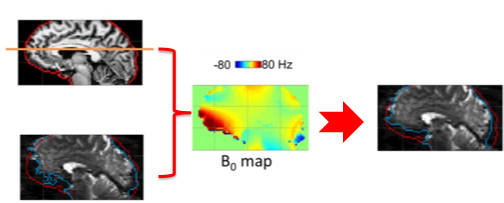

# Unveiling the Power of B0 Field Mapping: A Comprehensive Tutorial and Analysis in MRI
## About me

<a href="https://github.com/behrouzvia">
   
    <b>Behrouz Vejdani Afkham</b>
</a>

I am a first year PhD student at Polytechnique Montreal studying in biomedical engineering. I majored in Medical imaging at Tehran University of medical sciences which means I am already familiar with the basics of neuroimaging tools and methods. However, for my PhD, I need to familiarize myself with the state-of-the-art data science packages which make everything in neuroimaging data analysis a hassle-free procedure and create a short path to achieving my goals.

## Project Summary

My project aims to provide a tutorial on the principles of the B0 field mapping in MRI as well as explain existing approaches to calculating a B0 field map in an interactive way. Subsequently, the question of why B0 field maps are valuable in MRI will be answered by comparing the connectivity matrix of rs-fMRI from a single subject with and without utilizing the B0 field map in their processing pipeline.

### Introduction

### Main Objectives

- Illustration of three previously-mentioned methods of B0 mapping 
- Comparison of fMRI connectivity matrix with and without EPI undistortion

### Personal Objectives

- Emphasize on reproducibility of the analysis pipeline.
- Learn more about advanced visualization of the neuroimaging data.
- Understanding of fMRI connectivity concepts and processing steps.

### Tools
- Jupyter notebook for coding and visualization
- FSL command line tools for EPI undistortion
- Git and Github for Version Control
- DataLad for data Reproducibility
- Singularity container using NeuroDesk for Reproducibility
- fMRIPrep for rs-fMRI preprocessing
- Shimming toolbox for field mapping
- Python Packages: `matplotlib`, `seaborn`, `nilearn`, `plotly`, `Nibabel`, `scipy`, `Pandas`

### Data

### Project Deliverables

A Github repository
A Jupyter noteebook
An explanatory markdown document 

## Results

### Preprocessing using `fMRIprep`

## Conclusions

## Acknowledgements

## References